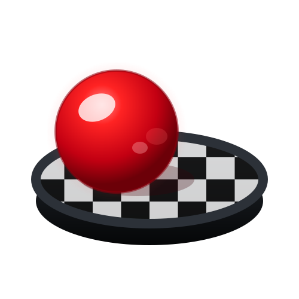
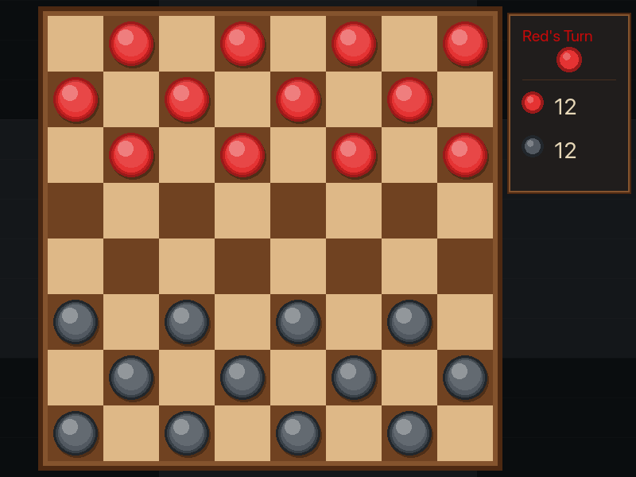
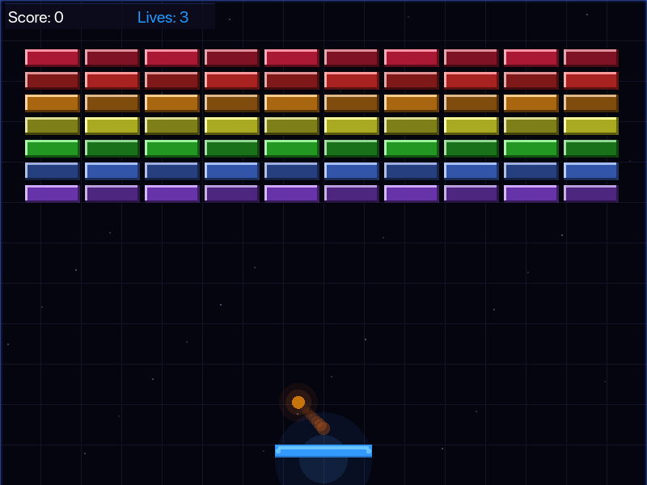

<div align="center">
  
</div>

<h1 align="center">dama-rb</h1>

<p align="center">
  A cross-platform 2D game engine with a Ruby DSL and Rust rendering backend.
</p>

<p align="center">
  <strong>Write games in Ruby. Render with wgpu. Run native or in the browser.</strong>
  <br />
  <a href="https://github.com/caiubi/dama-rb">View Demo</a>
</p>

<p align="center">
  <a href="https://github.com/caiubi/dama-rb/actions/workflows/ci.yml"></a>
  <a href="https://github.com/caiubi/dama-rb"></a>
  <a href="https://rubygems.org/gems/dama"></a>
</p>

---

dama-rb lets you build 2D games using an expressive Ruby DSL. The engine handles rendering via a Rust/wgpu backend (Metal, Vulkan, DX12, WebGPU), so your game code is pure Ruby while GPU-accelerated graphics run at native speed.

The name "dama" is inspired by the Japanese word for "orb" (玉) and the Portuguese word for the "checkers" game (dama).

## Screenshots

<p align="center">
  
  
</p>

## Features

- **Ruby DSL** — Standard CRuby 3.4 — bring your gems, your tools, your workflow
- **Rust/wgpu renderer** — GPU-accelerated shapes, text, sprites, shaders, and textures
- **Cross-platform** — Native (macOS, Linux, Windows) and web (WebGPU via ruby.wasm)
- **Input handling** — Keyboard, mouse (gamepad support is on the [roadmap](#roadmap))
- **Sprite rendering** — Draw textures from your assets folder
- **Shader support** 🔥 — Write custom fragment shaders in WGSL (basic functions supported)
- **Sound effects** — Play audio files within your game
- **Physics** — AABB collision detection with a simple API (Rapier2D integration is on the [roadmap](#roadmap))
- **HiDPI/Retina** — Sharp rendering on high-density displays
- **100% test coverage** — RSpec with headless native backend integration tests (Web build pipeline coverage is on the [roadmap](#roadmap))
- **MIT licensed** — Every feature, for everyone, forever

## Build Your First Game

### 1. Create a project

```bash
mkdir my_game && cd my_game
bundle init
bundle add dama
```

### 2. Scaffold the game

```bash
bundle exec dama new
```

This generates a playable starter project:

```
my_game/
├── bin/dama                       # game launcher
├── config.rb                      # game settings (resolution, title, start scene)
├── game/
│   ├── components/transform.rb    # position data
│   ├── nodes/player.rb            # entity with drawing
│   └── scenes/main_scene.rb      # composes nodes, handles input
└── assets/                        # images, sounds, shaders
```

### 3. Run it

```bash
bin/dama               # native window
bin/dama web           # browser (WebGPU)
```

You'll see a red circle you can move with the arrow keys.

### 4. How it works

dama-rb uses a **Component → Node → Scene** architecture:

```ruby
# Components hold pure data
class Transform < Dama::Component
  attribute :x, default: 0.0
  attribute :y, default: 0.0
end

# Nodes are entities — they own components and define drawing
class Player < Dama::Node
  component Transform, as: :transform, x: 400.0, y: 300.0

  draw do
    circle(transform.x, transform.y, 20.0, **Dama::Colors::RED.to_h)
  end
end

# Scenes compose nodes and handle game logic
class MainScene < Dama::Scene
  compose do
    add Player, as: :hero
  end

  update do |dt, input|
    hero.transform.x += 200.0 * dt if input.right?
    hero.transform.x -= 200.0 * dt if input.left?
  end
end

# config.rb boots the game — must define a GAME constant
GAME = Dama::Game.new do
  settings resolution: [800, 600], title: "My Game"
  start_scene MainScene
end
```

### 5. Make it yours

- Edit `game/scenes/main_scene.rb` to change game logic
- Add new nodes in `game/nodes/`
- Add new components in `game/components/`
- Put images, sounds, and shaders in `assets/`
- See the [examples](examples/) for physics, sprites, shaders, and scene transitions

## Architecture

```
Ruby DSL (your game code)
    ↓
Dama Engine (Ruby)
    ↓ FFI / JS bridge
Rust Backend (wgpu)
    ↓
GPU (Metal / Vulkan / WebGPU)
```

- **Ruby** handles game logic, scene graph, components, input, and the update loop
- **Rust** handles window management (winit), GPU rendering (wgpu), text (glyphon), and screenshots
- **Native**: Ruby calls Rust via FFI (cdylib)
- **Web**: Ruby runs in ruby.wasm, calls Rust wasm via JS bridge

## Drawing Primitives

```ruby
draw do
  rect(x, y, w, h, r:, g:, b:, a:)
  circle(cx, cy, radius, r:, g:, b:, a:)
  triangle(x1, y1, x2, y2, x3, y3, r:, g:, b:, a:)
  text("Hello", x, y, size: 24.0, r:, g:, b:, a:)
  sprite(texture_handle, x, y, w, h)
end
```

## Examples

- **[demo](examples/demo/)** — Shapes, sprites, FPS overlay, keyboard input
- **[checkers](examples/checkers/)** — Full 8x8 checkers game with piece selection, captures, king promotion, and scene transitions
- **[breakout](examples/breakout/)** — Brick breaker with physics, custom shaders, and score tracking

## Development

### Prerequisites

- Ruby 3.4+
- Rust (stable, via rustup)
- wasm-bindgen-cli (`cargo install wasm-bindgen-cli`)
- npm (for downloading ruby.wasm base binary — web builds only)

> **Note:** Web builds require `npm` (to download the ruby.wasm base binary) and `wasm-bindgen-cli`.

### Setup

```bash
git clone https://github.com/caiubi/dama-rb
cd dama-rb
bundle install
```

### Tests

```bash
bundle exec rspec              # Ruby specs (builds Rust automatically)
bundle exec rubocop            # Ruby linting
cd ext/dama_native && cargo test     # Rust tests
cd ext/dama_native && cargo clippy   # Rust linting
```

### Run examples

```bash
cd examples/checkers && bin/dama       # Native
cd examples/checkers && bin/dama web   # Browser
```

## Roadmap

### Rapier2D Physics
- [ ] Replace AABB with Rapier2D behind Cargo feature flag
- [ ] Continuous collision detection, joints, raycasting

### Game Framework Features
- [ ] Particle system
- [ ] UI framework (Button, Label, Panel)
- [ ] Tilemap (Tiled JSON format)
- [ ] Scene transitions (fade in/out)
- [ ] Save/Load (JSON, localStorage on web)

### Polish & Community
- [ ] Gamepad support
- [ ] Documentation site (YARD + GitHub Pages)
- [x] Project generator (`dama new my_game`)
- [ ] Hot reload
- [ ] Debug overlay
- [ ] Publish gem to RubyGems

### Web Integration Testing
- [ ] Capybara-like + Cuprite browser tests
- [ ] Game state assertion helpers
- [ ] CI integration

## License

[MIT](LICENSE)
